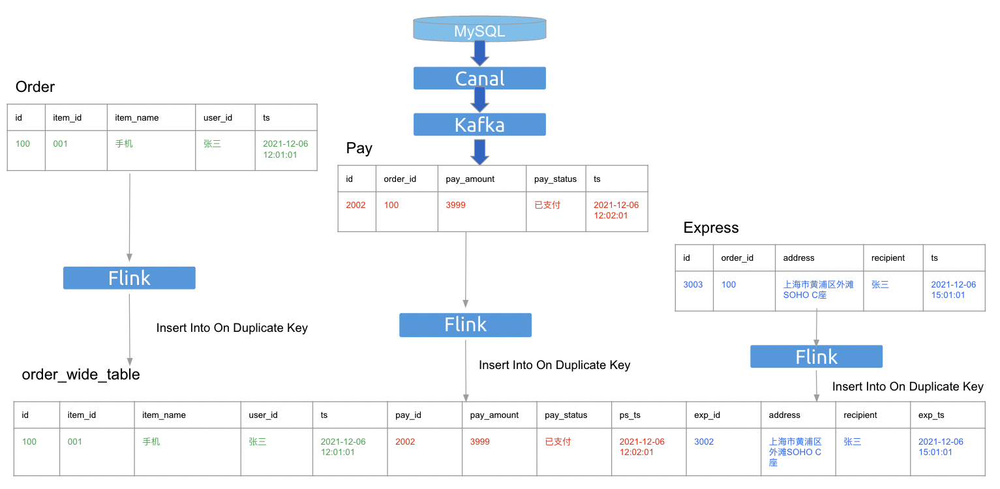

# Insert on duplicate key update

- Author(s): [yangxin](http://github.com/xuanyu66)
- Tracking Issue: https://github.com/tidb-incubator/TiBigData/issues/197

## Table of Contents

* [Introduction](#introduction)
* [Motivation or Background](#motivation-or-background)
* [Detailed Design](#detailed-design)
* [Compatibility](#compatibility)
* [Test Design](#test-design)
    * [Functional Tests](#functional-tests)
    * [Scenario Tests](#scenario-tests)
    * [Compatibility Tests](#compatibility-tests)
    * [Benchmark Tests](#benchmark-tests)
* [Impacts & Risks](#impacts--risks)
* [Investigation & Alternatives](#investigation--alternatives)
* [References](#references)

## Introduction

This design doc is about how to achieve `INSERT ... ON DUPLICATE KEY UPDATE` semantics in TiDBDynamicTable.

## Motivation or Background

It is a common requirement that partially updates some fields based on the primary key in the `Materialized View` scenario.



However, Flink SQL doesn't support statement `INSERT ... ON DUPLICATE KEY UPDATE`. So we need find an alternative way to achieve `INSERT ... ON DUPLICATE KEY UPDATE` semantics. 

## Detailed Design

### Use `SQL Hints` achieve `INSERT ... ON DUPLICATE KEY UPDATE` semantics


```sql
INSERT INTO `tidb`.`dstDatabase`.`dstDatabase` /*+ OPTIONS('tidb.sink.update-columns'='c2, c13') */ 
SELECT c1,c2,c3,c4,c5,c6,c7,c8,c9,c10,c11,c12,c13,c14,c15,c16,c17 from `tidb`.`srcDatabase`.`srcDatabase`
```


## Compatibility

Compatibility is important, please also take into consideration, a checklist:
- Compatibility with other features, like partition table, security&privilege, collation&charset, clustered index, async commit, etc.
- Compatibility with other internal components, like parser, DDL, planner, statistics, executor, etc.
- Compatibility with other external components, like PD, TiKV, TiFlash, BR, TiCDC, Dumpling, TiUP, K8s, etc.
- Upgrade compatibility
- Downgrade compatibility

## Test Design

A brief description of how the implementation will be tested. Both the integration test and the unit test should be considered.

### Functional Tests

It's used to ensure the basic feature function works as expected. Both the integration test and the unit test should be considered.

### Scenario Tests

It's used to ensure this feature works as expected in some common scenarios.

### Compatibility Tests

A checklist to test compatibility:
- Compatibility with other features, like partition table, security & privilege, charset & collation, clustered index, async commit, etc.
- Compatibility with other internal components, like parser, DDL, planner, statistics, executor, etc.
- Compatibility with other external components, like PD, TiKV, TiFlash, BR, TiCDC, Dumpling, TiUP, K8s, etc.
- Upgrade compatibility
- Downgrade compatibility

### Benchmark Tests

The following two parts need to be measured:
- The performance of this feature under different parameters
- The performance influence on the online workload

## Impacts & Risks

Describe the potential impacts & risks of the design on overall performance, security, k8s, and other aspects. List all the risks or unknowns by far.

Please describe impacts and risks in two sections: Impacts could be positive or negative, and intentional. Risks are usually negative, unintentional, and may or may not happen. E.g., for performance, we might expect a new feature to improve latency by 10% (expected impact), there is a risk that latency in scenarios X and Y could degrade by 50%.

## Investigation & Alternatives

How do other systems solve this issue? What other designs have been considered and what is the rationale for not choosing them?

## References

List the reference materials here.