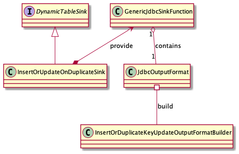

# Real-time wide table 

- Author(s): [yangxin](http://github.com/xuanyu66)
- Tracking Issue: https://github.com/tidb-incubator/TiBigData/issues/197

## Table of Contents

* [Introduction](#introduction)
* [Motivation or Background](#motivation-or-background)
* [Detailed Design](#detailed-design)
* [Compatibility](#compatibility)
* [Test Design](#test-design)
    * [Functional Tests](#functional-tests)
    * [Scenario Tests](#scenario-tests)
    * [Compatibility Tests](#compatibility-tests)
    * [Benchmark Tests](#benchmark-tests)
* [Impacts & Risks](#impacts--risks)
* [Investigation & Alternatives](#investigation--alternatives)
* [References](#references)

## Introduction

This design doc is about how to sink Real-time wide table in TiDBDynamicTable.

## Motivation or Background

It is a common requirement that partially updates some fields based on the primary key in the `Real-time wide table` scenario.


Inevitably， it occurs to us that it's a suitable way to use `INSERT ... ON DUPLICATE KEY UPDATE`  
However, Flink SQL doesn't support the statement `INSERT ... ON DUPLICATE KEY UPDATE`. So we need to find an alternative way to achieve `INSERT ... ON DUPLICATE KEY UPDATE` semantics in TiDBDynamicTable. 

## Detailed Design

The design will be divided into two parts, one is how it is implemented at the SQL syntax level, in other words, how the user passes all the required parameters. 
The other part is the implementation of `DynamicTableSink` interface to interact with the TiDB-server.

### Use `SQL Hints` to pass update columns

With option `tidb.sink.update-columns` in SQL hints, update-columns would be passed to `TiDBDynamicTable`. Combined with `INSERT INTO` clause, we have gotten all information needed.

For example, c2 and c4 are the columns needed to be updated, SQL is as follows.

```sql
INSERT INTO `tidb`.`dstDatabase`.`dstTable` /*+ OPTIONS('tidb.sink.update-columns'='c2, c4') */ 
SELECT c1,c2,c3,c4 from `tidb`.`srcDatabase`.`srcTable`

// the same as above 
INSERT INTO `tidb`.`dstDatabase`.`dstTable` /*+ OPTIONS('tidb.sink.update-columns'='c2, c4') */
VALUES('v1', 'v2', 'v3', 'v4')
```

> [!NOTE]
> Currently we don't support ```INSERT INTO `tidb`.`dstDatabase`.`dstDatabase` /*+ OPTIONS('tidb.sink.update-columns'='c2, c4') */ (c2, c4)
VALUES('v2', 'v4')```, since there is a [bug](https://issues.apache.org/jira/browse/FLINK-27683) in Flink SQL.

### Argument constraints

Due to reasons mentioned in [MySQL Reference Manual](https://dev.mysql.com/doc/refman/8.0/en/insert-on-duplicate.html), we should try to avoid using an ON DUPLICATE KEY UPDATE clause on tables with multiple unique indexes.
So we will check the following argument constraints before execution in case of an unexpected result.
- the destination table should contain only one unique key(including primary key).
- the update columns should contain only one unique key column(including primary key).

It should be noted that this validation is optional(default not skip). Users can explicitly skip the validation, but be aware of the risks.

### Implement `InsertOrUpdateOnDuplicateSink`

`InsertOrUpdateOnDuplicateSink` implement the interface `DynamicTableSink`, provide `GenericJdbcSinkFunction` to sink data.
`GenericJdbcSinkFunction` require `JdbcOutputFormat` to generate FieldNamedPreparedStatement, extract data from rowData.



#### Generate FieldNamedPreparedStatement `INSERT ... ON DUPLICATE KEY UPDATE`

With `tidb.sink.update-columns`, we can easily generate `INSERT ... ON DUPLICATE KEY UPDATE` clause as follows. 

```sql
INSERT INTO `tidb`.`dstDatabase`.`dstTable` (`c2`, `c4`) VALUES (:c2, :c4) ON DUPLICATE KEY UPDATE `c2`=VALUES(:c2), `c4`=VALUES(:c4)
```

### Column Pruning

Use a wrapper class to prune column, which contains an array to store the indexes needed

```java
public class DuplicateKeyUpdateOutputRowData implements RowData {

  private final RowData rowData;
  private final int[] index;

  public DuplicateKeyUpdateOutputRowData(RowData rowData, int[] index) {
    this.rowData = rowData;
    this.index = index;
  }

  @Override
  public int getArity() {
    return index.length;
  }

  @Override
  public boolean isNullAt(int pos) {
    return rowData.isNullAt(index[pos]);
  }

}
```

## Test Design

- insert on duplicate update without unique key.
- insert on duplicate update with only one unique key.
- insert on duplicate update with multiple unique keys(skip the constraint).
- insert on duplicate update with multiple unique keys(keep the constraint).


