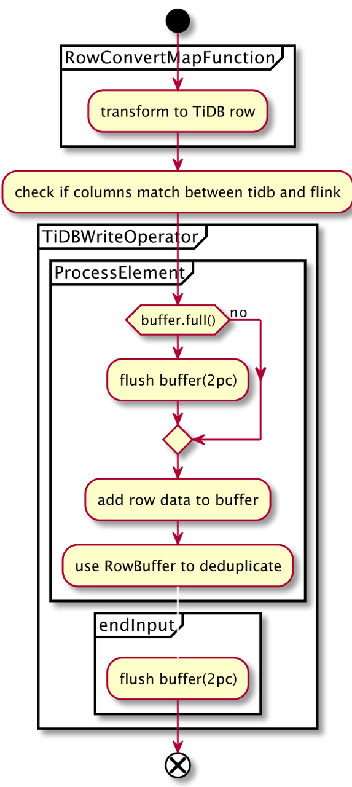

# Flink connector write bypass TiDB

- Author(s): [yangxin](http://github.com/xuanyu66)
- Tracking Issue: https://github.com/tidb-incubator/TiBigData/issues/163

## Table of Contents

* [Introduction](#introduction)
* [Motivation or Background](#motivation-or-background)
* [Detailed Design](#detailed-design)
* [Compatibility](#compatibility)
* [Test Design](#test-design)
    * [Functional Tests](#functional-tests)
    * [Scenario Tests](#scenario-tests)
    * [Compatibility Tests](#compatibility-tests)

## Introduction

This article introduces an optimized solution for writing Flink connector to TiDB cluster, by bypassing TiDB server and writing TiKV directly.

## Motivation or Background

Currently, Fink connector uses JdbcDynamicTableSink to write data, which doesn't provide transaction semantics.

However, this approach leads to the following problems.
- Lack of atomicity, if the Flink task fails and exists during the writing process, some data will be written successfully while the others not.
- Lack of isolation, other transactions can see part of the written data during the writing process.
- Lack of failure recovery mechanism, tasks need to be idempotency, for example, after failure, you need to clean up written data first, and then re-run the Flink program.
- Latency is higher than directly writing to TiKV.
- Streaming or batch processing of large data will affect the performance of TiDB server and thus affect online business queries.

In contrast to this, Fink connector direct-write TiKV can solve these problems.
- TiKV provides transaction support for atomic, isolation, and failure recovery.
- Writing directly to TiKV has lower latency and thus does not affect the TiDB server.

In terms of feasibility, Spark connector has proven the feasibility of writing bypass TiDB.

## Detailed Design

### Add TiDBDynamicTableSink option

In the factory method of TiDBDynamicTableFactory, we will add TiDBDynamicTableSink option. The user can choose how to write data by setting the Sink mode (JDBC or TiKV). 

### Implement different dimensional transaction levels

TiKV implements Google's Percolator transaction mode, which is a variation of 2pc. See [tikv-transaction-model](https://tikv.org/deep-dive/distributed-transaction/introduction). 

For each transaction commit, we select a row as the primary key and perform a two-stage commit, while the transaction satisfies the ACID principle.

Transaction levels can be classified as Global, MiniBatch, Checkpoint:
- Global is only applicable to bounded data streams, where all written data is considered as a whole and written to TiKV through one big transaction, which is not recommended if there are frequent write conflicts.
- Checkpoint only supports data sources with checkpointing enabled, Flink uses each checkpoint as a transaction separator, and records commit transaction information through the checkpoint, which combined with TiKV's two-stage commit, can achieve the semantics of exactly once when writing TiDB upstream.
- MiniBatch has no restriction on data sources, no global transaction semantics, and writes to TiDB with a single Task as the dimension. TiDB will be written when the data reaches a specified number of rows or a certain interval since the last write.

### Data de-duplication

If there is a unique index conflict in the data of the same transaction, there will likely be index inconsistency, so the data of the same transaction needs to be de-duplicated.

It is worth noting that data de-duplication is an indeterminate act and there is no guarantee which data will be retained. If there are certain rules for de-duplication, please ensure that the data is not duplicated by the user.
- MiniBatch mode uses HashMap de-duplication because the number of rows is small and there is no need to communicate with other nodes.
- Checkpoint uses KeyedProcessFunction, the same key will be routed to the same function instance, then check the checkpointEntry stored in the global state to determine if it is inside the same checkpoint, if so, de-duplication will be performed.
- Global Using KeyedProcessFunction, the same key will be routed to the same function instance, then check isExisted in the global state store to determine if the same data already exists, and if so, de-duplicate.

## Procedure design

The procedure design of the three modes shows as follows.

It is worth noting that the box actually indicates the add of Transformation, and the operation of the Transformation is not executed immediately, but later executed in parallel in each TaskManager. Transformation includes Function and Operator. So the flowchart shows the order in which each Transformation is added.

### MiniBatch mode

ProcessElement is executed once when it iterates over each element. As you can see, MiniBatch has no global transaction guarantee and performs a 2pc write to the data whenever the number of data rows reaches a certain threshold.

### Global

Global prewrites the primary key when the stream is generated, then the ProcessElement only prewrites the Secondary Keys and commits the primary key once all the data has been written.

### Checkpoint

Unlike the previous two implementations, TIDBSinkFunction inherits TwoPhaseCommitSinkFunction, which provides exactly-once semantics. calls to the commit function occur at the checkpoint node, as described in [TwoPhaseCommitSinkFunction](https://nightlies.apache.org/flink/flink-docs-master/api/java/org/apache/flink/streaming/api/functions/sink/TwoPhaseCommitSinkFunction.html).

## Compatibility

Flink Connector is backward compatible, the previous JDBC sink method still exists, and users can choose write-mode which they want.

## Test Design

A brief description of how the implementation will be tested. Both the integration test and the unit test should be considered.

### Functional Tests

- feature AUTO_INCREMENT
- RowIDAllocator
- BufferRow deduplication
- ShardRowIDBits 
- upsert, insert

### Scenario Tests

- mode global, mini-batch, checkpoint.

### Compatibility Tests

- Compatibility with TiDB 4.x 5.x

