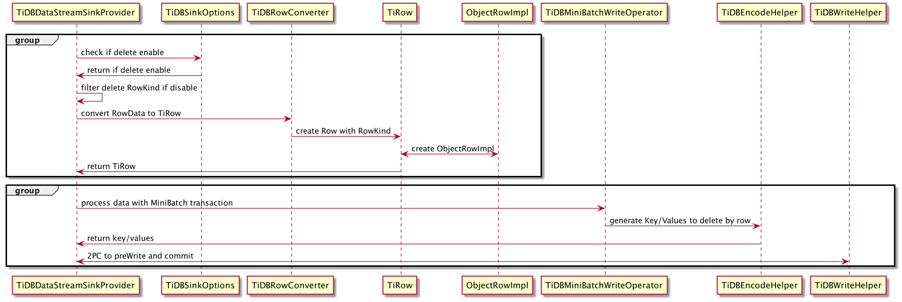
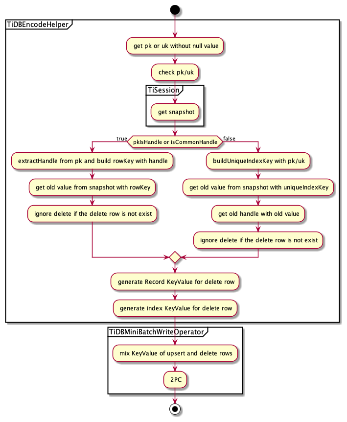

# Flink connector Delete Feature

- Author(s): [Shi Yuhang](http://github.com/shiyuhang0)
- Tracking Issue: https://github.com/tidb-incubator/TiBigData/issues/200

## Table of Contents

* [Introduction](#introduction)
* [Motivation or Background](#motivation-or-background)
* [Detailed Design](#detailed-design)
  * [New Configuration](#new-configuration)
  * [Main Steps](#main-steps)
  * [Delete Logical](#delete-logical)
  * [Row Order](#row-order)
* [Compatibility](#compatibility)
* [Test Design](#test-design)

## Introduction

Support delete feature in streaming mode for TiBigData/Flink.

## Motivation or Background

Currently, TiBigData/Flink doesn't support DELETE RowKind in the TiKV sink. In other words, we can't consume delete changelog to execute delete.
As a real batch&streaming engine, it's necessary to support delete in Flink. 
- Delete will bypass TiDB
- Delete is supported in streaming mode

## Detailed Design

### New Configuration

We introduce a new configuration `sink.tikv.delete-enable` to control delete.
- The configuration is a boolean type with the default value `false`, which will disable the delete feature.
- The configuration can only work in MINIBATCH transaction and upsert mode, or delete RowKind will be filtered.
- Only support delete from table with pk/uk, make sure at least one pk/uk's value is not null. (every column should not be null for multiple-column pk/uk)

### Main Steps

Here are the main steps to support the delete feature:
- Add the configuration to open delete.
- Check if delete is enabled. If you are not in MINIBATCH transaction or upsert mode, delete will be disabled even you configure `sink.tikv.delete-enable` to `true`.
- Use a new class TiRow to distinguish between delete RowKind and insert/update RowKind in MiniBatch.
- Exclude delete RowKind to upsert when flush rows buffer.
- Use delete RowKind to delete when flush rows buffer.
  - check pk/uk
  - extract handle
  - encode key/value of records and index
- 2PC to commit both the upsert and delete key/value.

### Delete Logical

> TiBigData/Flink only supports delete from table with pk/uk, or exception will be thrown.

At first, check pk/uk and get snapshot.

Then, get handle and value of delete row ,we will ignore the rows which do not exist in the table.

After that, generate record key/value with handle and generate index key/value with index.

At last, mix the upsert and delete keyValue to do two phase commit in a transaction.

### Row Order

It is important to keep order in streaming mode, or we may get the error results.
- TiCDC will ingest the changelogs and sink to kafka. So, make sure kafka will partition the messages by key.
- It's better to optimize deduplication and leave the latest operation for the same row.
- When Flink executes sink distributedly, make sure the operations on the same row will be sent to the same task.

## Compatibility

- Delete can't work with batch mode, because Flink doesn't support the DELETE statement now.
- Delete only works in MINIBATCH transaction. If you work in GLOBAL transaction, delete row will be ignored.
- Delete only works with upsert mode. If you are in append mode, delete row will be ignored.
- Delete only works with tables which have pk/uk, and at least one pk/uk's value is not null (every column should not be null for multiple-column pk/uk), or the exception will be thrown.
- Delete can work in json, craft and canal_json codec

## Test Design

| scenes                              | expected results        |
|-------------------------------------|-------------------------|
| global & enable delete              | delete rows be ignored  |
| minibatch & enable delete & append  | delete rows be ignored  |
| minibatch & disable delete & upsert | delete rows be ignored  |
| minibatch & enable delete & upsert  | delete correctly        |
| table with pk                       | delete correctly        |
| table with uk                       | delete correctly        |
| table with mutile-column uk         | delete correctly        |
| codec: json                         | delete correctly        |
| codec: craft                        |                         |
| codec: canal_json                   | delete correctly        |
