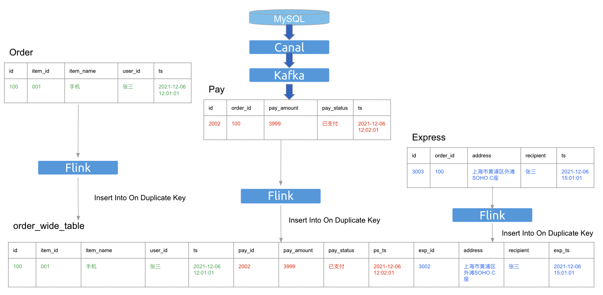

# Real-time wide table

* [Real-time wide table](#real-time-wide-table)
    * [Background](#background)
    * [Supports and Limitations](#supports-and-limitations)
    * [How to use](#how-to-use)
    * [Constraints](#constraints)
        * [Constraints on the destination table](#constraints-on-the-destination-table)
        * [Constraints on the update columns](#constraints-on-the-update-columns)

## Background

Users maybe want to partially update some fields based on the unique key(including the primary key) in the `Real-time wide table` scenario.



## Supports and Limitations

- only work when `tidb.write_mode` is `upsert`.
- only work when `tidb.sink.impl` is `JDBC`.
- work in both `batch` and `streaming` execution mode.

## How to use

Create a catalog in flink sql client:

```sql
CREATE
CATALOG `tidb`
WITH (
    'type' = 'tidb',
    'tidb.database.url' = 'jdbc:mysql://localhost:4000/test',
    'tidb.username' = 'root',
    'tidb.password' = ''
);
```

Using mysql client to create a table with a unique key(or primary key) in TiDB:

```bash
# connect to TiDB
mysql --host 127.0.0.1 --port 4000 -uroot --database test
```

```sql
CREATE TABLE `order_wide_table`
(
    `id`   int not null,
    `name` varchar(256),
    `item_id` int, 
    `item_name` varchar(256), 
    `user_id` varchar(256), 
    `ts` timestamp,
    `pay_id` int, 
    `pay_amount` int, 
    `pay_status` int, 
    `ps_ts` timestamp,
    `exp_id` int, 
    `address` varchar(256), 
    `recipient` varchar(256), 
    `exp_ts` timestamp, 
    primary key(`id`)
);
```

Using flink sql client to sink in `Real-time wide table` scenario. You can set an arbitrary value to the column which does not exist in `'tidb.sink.update-columns'`, since they will never be used, just as a placeholder:

```sql
// the first source
INSERT INTO `tidb`.`dstDatabase`.`order_wide_table` /*+ OPTIONS('tidb.sink.update-columns'='id, item_id, item_name, user_id, ts') */
VALUES(100, 
    001, '手机','张三', 2021-12-06 12:01:01, 
    -1, -1, 'unknown', 1999-11-11 11:11:11,
    -1, "hell", 'god', 1999-11-11 11:11:11)

// the second source
INSERT INTO `tidb`.`dstDatabase`.`order_wide_table` /*+ OPTIONS('tidb.sink.update-columns'='id, pay_id, pay_amount, pay_status, ps_ts') */
VALUES(100, 
    -1, 'soul', 'adam', 1999-11-11 11:11:11,
    2002, 399, '已支付', 2021-12-06 12:02:01, 
    -1, "hell", 'god', 1999-11-11 11:11:11))

// the third source
INSERT INTO `tidb`.`dstDatabase`.`order_wide_table` /*+ OPTIONS('tidb.sink.update-columns'='id, exp_id, address, recipient, exp_ts') */
VALUES(100, 
    -1, 'soul', 'adam', 1999-11-11 11:11:11,
    -1, -1, 'unknown', 1999-11-11 11:11:11,
    3002, '上海市黄浦区外滩SOHO C座', '张三', 2021-12-06 15:01:01)
```

> **NOTE:**
> Currently we don't support ```INSERT INTO `tidb`.`dstDatabase`.`dstTable` /*+ OPTIONS('tidb.sink.update-columns'='id, item_id, item_name, user_id, ts') */ (id, item_id, item_name, user_id, ts)
VALUES(100, 001, '手机'，'张三'，2021-12-06 12:01:01)```, since there is a [bug](https://issues.apache.org/jira/browse/FLINK-27683) in Flink SQL.

> **NOTE:**
> `tidb.sink.update-columns` is only working in SQL hints. If you set this in catalog properties, it will raise an `IllegalArgumentException`.

## Constraints

To achieve real-time wide table joining, we default check some constraints.

### Constraints on the destination table

The destination table should contain only one not-null unique key(including the primary key).
- Multiple-Column Indexes should be all not-null.

Due to reasons mentioned in [insert-on-duplicate](https://dev.mysql.com/doc/refman/8.0/en/insert-on-duplicate.html), we should try to avoid using an ON DUPLICATE KEY UPDATE clause on tables with multiple unique indexes.
Due to `NULL` meaning "a missing unknown value" [working-with-null](https://dev.mysql.com/doc/refman/8.0/en/working-with-null.html), in the other words, `NULL`  does not equal `NULL`, which will cause inserting instead of updating when the key is `NULL`.

### Constraints on the update columns

The update columns should contain the unique key column(including the primary key).

### Skip the constraints

You can set `tidb.sink.skip-check-update-columns` true to force skip check, but we don't recommend you to do it.
With setting `tidb.sink.skip-check-update-columns`, it will regress to `ON DUPLICATE KEY UPDATE` semantics, in which there is no join guarantee.

```sql
CREATE
CATALOG `tidb`
WITH (
    'type' = 'tidb',
    'tidb.database.url' = 'jdbc:mysql://localhost:4000/test',
    'tidb.username' = 'root',
    'tidb.password' = '',
    'tidb.sink.skip-check-update-columns' = 'true'
);
```
