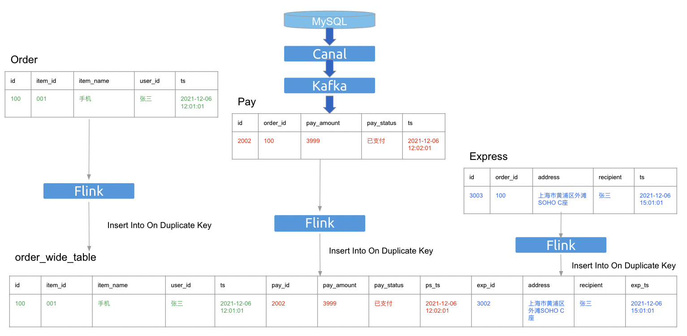

# 实时宽表

* [实时宽表](#实时宽表)
    * [背景](#背景)
    * [支持与限制](#支持与限制)
    * [使用指南](#使用指南)
    * [约束](#约束)
        * [对目的表的约束](#对目的表的约束)
        * [对更新列的约束](#对更新列的约束)


## 背景

在实时宽表场景中，用户会需要根据唯一索引去更新宽表中的部分列数据，如下图所示：



## 支持与限制

- 只有当 `tidb.write_mode` 为 `upsert` 时才能正常工作。
- 只有懂 `tidb.sink.impl` 为 `JDBC` 时才能正常工作。
- 同时适用于 `batch` 和 `streaming` 执行模式。

## 使用指南

使用 flink sql client 建立 catalog:

```sql
CREATE
CATALOG `tidb`
WITH (
    'type' = 'tidb',
    'tidb.database.url' = 'jdbc:mysql://localhost:4000/test',
    'tidb.username' = 'root',
    'tidb.password' = ''
);
```

使用 mysql client 在 TiDB 中建表:

```bash
# connect to TiDB
mysql --host 127.0.0.1 --port 4000 -uroot --database test
```

```sql
CREATE TABLE `order_wide_table`
(
    `id`   int not null,
    `name` varchar(256),
    `item_id` int, 
    `item_name` varchar(256), 
    `user_id` varchar(256), 
    `ts` timestamp,
    `pay_id` int, 
    `pay_amount` int, 
    `pay_status` int, 
    `ps_ts` timestamp,
    `exp_id` int, 
    `address` varchar(256), 
    `recipient` varchar(256), 
    `exp_ts` timestamp, 
    primary key(`id`)
);
```

使用 flink sql client 在 `实时宽表` 场景下写入数据. `mock_${value}` 不会被使用，只是作为一个占位符存在:

```sql
// 第一个数据源
INSERT INTO `tidb`.`dstDatabase`.`order_wide_table` /*+ OPTIONS('tidb.sink.update-columns'='id, item_id, item_name, user_id, ts') */
VALUES(100, 001, '手机','张三', 2021-12-06 12:01:01, mock_pay_id, mock_pay_amount, mock_pay_status, mock_ps_ts, mock_exp_id, mock_address, mock_recipient, mock_exp_ts)

// 第二个数据源
INSERT INTO `tidb`.`dstDatabase`.`order_wide_table` /*+ OPTIONS('tidb.sink.update-columns'='id, pay_id, pay_amount, pay_status, ps_ts') */
VALUES(100, mock_item_id, mock_item_name, mock_user_id, mock_ts, 2002, 399, '已支付', 2021-12-06 12:02:01, mock_exp_id, mock_address, mock_recipient, mock_exp_ts)

// 第三个数据源
INSERT INTO `tidb`.`dstDatabase`.`order_wide_table` /*+ OPTIONS('tidb.sink.update-columns'='id, exp_id, address, recipient, exp_ts') */
VALUES(100, mock_item_id, mock_item_name, mock_user_id, mock_ts, mock_pay_id, mock_pay_amount, mock_pay_status, mock_ps_ts, 3002, '上海市黄浦区外滩SOHO C座', '张三', 2021-12-06 15:01:01)
```

> **NOTE:**
>  目前并不支持 ```INSERT INTO `tidb`.`dstDatabase`.`dstTable` /*+ OPTIONS('tidb.sink.update-columns'='id, item_id, item_name, user_id, ts') */ (id, item_id, item_name, user_id, ts)
VALUES(100, 001, '手机'，'张三'，2021-12-06 12:01:01)```, 这是因为 Flink 已知的[bug](https://issues.apache.org/jira/browse/FLINK-27683)。

> **NOTE:**
> `tidb.sink.update-columns` 只能在 SQL hints 里使用 . 如果你在 catalog 中使用该参数, 程序会抛出一个 `IllegalArgumentException`。

## 约束

为了避免产生不可预期的结果，我们默认会执行一些严格的约束检查. 你可以指定 `tidb.sink.skip-check-update-columns` 为 true 来跳过约束检查。

```sql
CREATE
CATALOG `tidb`
WITH (
    'type' = 'tidb',
    'tidb.database.url' = 'jdbc:mysql://localhost:4000/test',
    'tidb.username' = 'root',
    'tidb.password' = '',
    'tidb.sink.skip-check-update-columns' = 'true'
);
```

### 对目的表的约束

目的表应该包含且只包含一个非空唯一索引。
- 联合索引情况下，全部索引应为非空。

由于该文档 [insert-on-duplicate](https://dev.mysql.com/doc/refman/8.0/en/insert-on-duplicate.html) 中提到的原因, 我们应该避免在 ON DUPLICATE KEY UPDATE 语句中使用多个唯一索引。如果关闭该约束，用户需要保证源数据能满足不会与表内的多行数据产生唯一索引冲突的条件。
由于 `NULL` 表示 “a missing unknown value” [working-with-null](https://dev.mysql.com/doc/refman/8.0/en/working-with-null.html), 换一句话说, `NULL` 不会等于 `NULL`，因此语句会从 update 转化为 insert。如果关闭该约束，用户需要保证源数据的唯一键不会为 `NULL`。

### 对更新列的约束

更新列需要包含唯一索引列。
