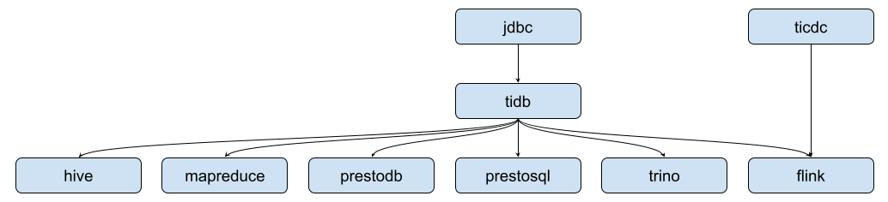

# 组件

jdbc: 轻量级的 JDBC 包装，为 MySQL JDBC driver 提供客户端负载均衡能力，避免外部负载均衡器依赖简化系统结构，节约负载均衡器资源消耗。

tidb: 面向大数据计算引擎分布式数据处理场景的 TiDB 客户端实现，旨在简化上层 connector 开发的复杂度最大化的复用通用能力。比如结构化数据处理、bypass TiDB 的批风格数据读取、任务分片和分布式全局一致性快照读等能力。

ticdc: TiCDC open protocol 和 craft 两种编码格式数据的解析库，为上层 connector 提供 TiDB change log 数据的解析能力。

mapreduce: MapReduce 的 TiDB connector 实现，为 MapReduce 任务带来批风格分布式读取 TiDB 数据的能力。

hive: Hive 的 TiDB storage handler，为 Hive 带来分布式读取 TiDB 数据的能力。

prestodb: PrestoDB 的 TiDB connector 实现，为 PrestoDB 带来批风格分布式读写 TiDB 数据的能力。

prestosql: PrestoSQL 的 TiDB connector 实现，为 PrestoDB 带来批风格分布式读写 TiDB 数据的能力。

trino: PrestoSQL 的 TiDB connector 实现，为 PrestoDB 带来批风格分布式读写 TiDB 数据的能力。

flink: Flink 的 TiDB connector 实现，为 Flink 带来流批一体分布式读写 TiDB 数据的能力。
