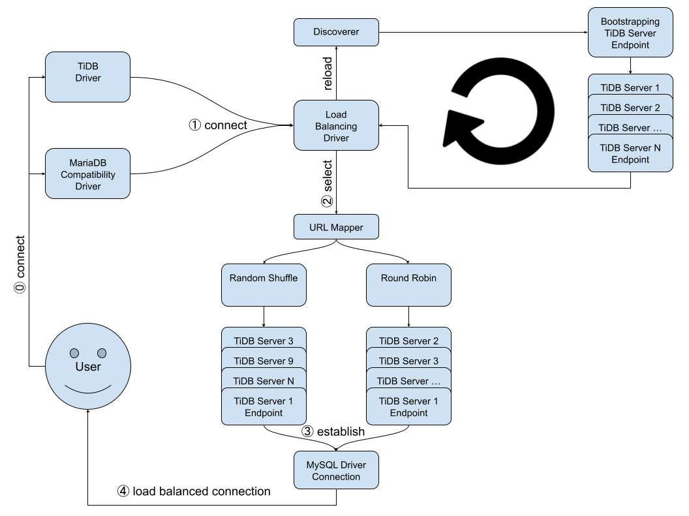

# TiDB JDBC Driver



## Build

```bash
# get project
git clone git@github.com:tidb-incubator/TiBigData.git
cd TiBigData

# compile and package
mvn clean package -DskipTests -am -pl jdbc/driver,jdbc/mariadb-compat

```

## Configuration

| Configration                       | Default Value | Description                                                  |
| :--------------------------------- | :------------ | :----------------------------------------------------------- |
| tidb.jdbc.url-mapper               | -             | mapper implementation to customize load balancing strategy. There are two builtin implementations `random` and `roundrobin` and the default implementation is `random`. Users can use their own implementation to replace as long as it implements Function<String[], String[]> |
| tidb.jdbc.min-discovery-interval   | 1000          | Minimal interval for discovery, concurrent connect requests will only trigger discovery once and reuse the same servers list unless last discovery was performed later then `tidb.jdbc.min-discovery-interval` milliseconds ago. |
| tidb.jdbc.max-discovery-interval   | 3600000       | Maximal interval for discovery, driver triggers discovery once every `tidb.jdbc.max-discovery-interval` milliseconds when there was no `connect` to trigger discovery at all. |

## Usage

### TiDB JDBC driver

TiDB JDBC driver is a lightweigh wrapper to MySQL Connector/J to support client side load balancing. Therefore it shares almost everything that MySQL Connector/J already has. Most likely changing URL prefix from jdbc:mysql:// to jdbc:tidb:// will work.

```
jdbc:tidb://[hosts][/database][?properties]
```

JAR: jdbc/driver/target/tidb-jdbc-driver-${project.version}.jar

Class Name: io.tidb.bigdata.jdbc.TiDBDriver

### TiDB MariaDB compatibility driver

TiDB MariaDB compatibility driver is a wrapper to TiDB JDBC driver for applications that only supports limit set of know drivers. Therefore it shares everything that TiDB JDBC driver already has. Simply changing URL prefix from jdbc:tidb:// to jdbc:mariadb:// will work.

```
jdbc:mariadb://[hosts][/database][?properties]
```

JAR: jdbc/mariadb-compat/target/tidb-jdbc-mariadb-compat-${project.version}.jar

Class Name: org.mariadb.jdbc.Driver
